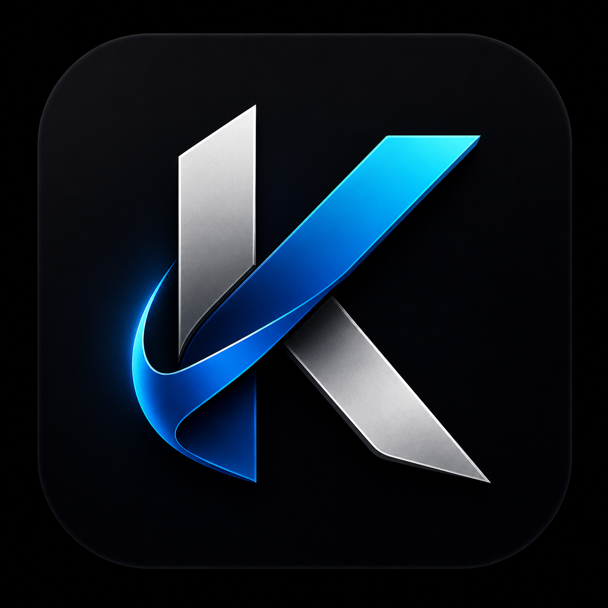
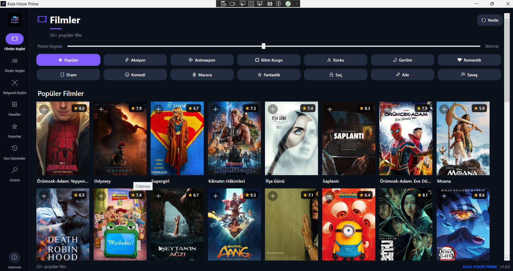
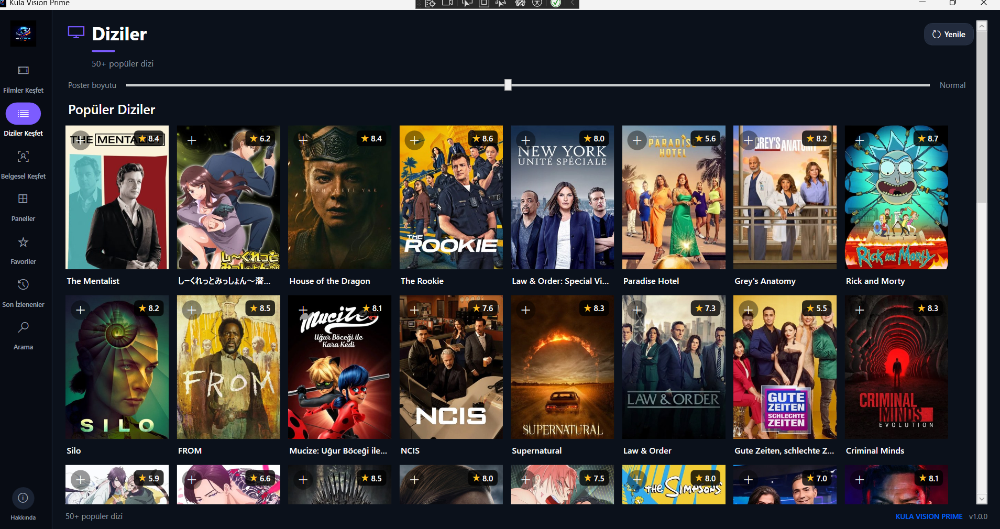
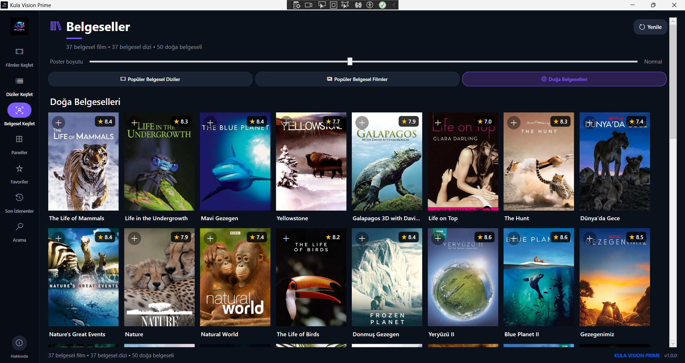
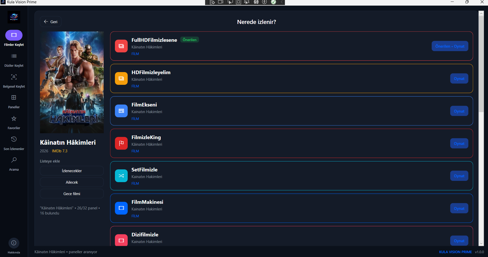
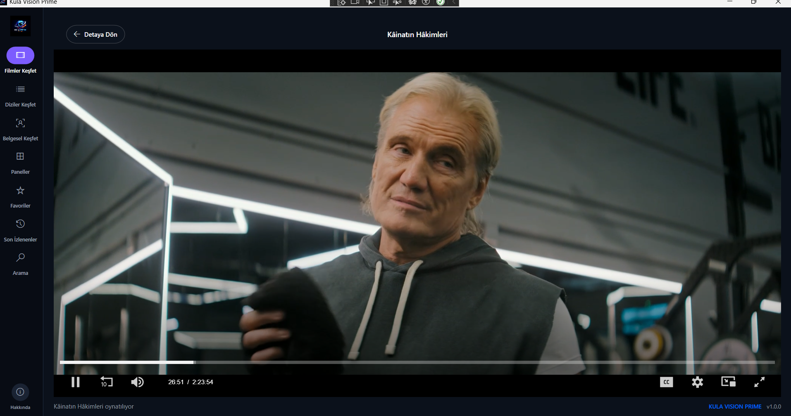

  

<h1 align="center">🎬 Kula Vision Prime</h1>

  Modern Windows Media Discovery Platform

  🇬🇧 <a href="#english">English</a> • 🇹🇷 <a href="#turkce">Türkçe</a>

  
  
  
  

---

# 🇹🇷 Türkçe

## Hakkında

**Kula Vision Prime**, film, dizi, belgesel, spor ve canlı yayın panellerini tek bir modern ve kullanıcı dostu arayüzde bir araya getiren Windows masaüstü uygulamasıdır.

> **Platform:** Windows 10 / 11 • .NET 8 • WPF • WebView2

---

## ✨ Özellikler

* 🎬 Film, dizi, belgesel, spor ve canlı TV panelleri
* 🔍 Global arama
* ⭐ Favoriler sistemi
* 🕒 İzleme geçmişi
* ▶️ Dahili WebView2 medya oynatıcısı
* 🖼️ TMDB poster ve içerik bilgileri
* 📺 Trakt entegrasyonu
* 🌙 Modern koyu tema
* ⚡ Hızlı açılış (Splash Screen)
* 📂 Portable kullanım (Kurulum gerektirmez)

---

## 📦 Kurulum

1. **KulaVisionPrime-vX.Y.Z.zip** dosyasını indirin.
2. Dosyaları istediğiniz klasöre çıkarın.
3. **KulaVisionPrime.exe** dosyasını çalıştırın.

Kurulum sihirbazı gerekmez.

---

## 🖼️ Ekran Görüntüleri

### 🎬 Filmler

### 📺 Diziler

### 🌍 Belgeseller

### 🔎 Panel Seçimi

### ▶️ Medya Oynatıcısı

---

## 🛠️ Kullanılan Teknolojiler

* C#
* .NET 8
* WPF
* WebView2
* JSON
* TMDB API
* Trakt API

---

## 👨‍💻 Geliştirici

**Mustafa Kula**

📧 **[mustafakula@proton.me](mailto:mustafakula@proton.me)**

---

## ⚠️ Sorumluluk Reddi

Kula Vision Prime herhangi bir medya içeriğini barındırmaz, depolamaz veya dağıtmaz. Uygulama yalnızca üçüncü taraf web içeriklerine erişim sağlayan bir istemci uygulamasıdır. Kullanıcılar, eriştikleri içeriklerin kullanım şartlarına ve kendi ülkelerindeki telif hakkı mevzuatına uymaktan kendileri sorumludur.

---

## 📄 Lisans

© 2026 Mustafa Kula — Tüm hakları saklıdır.

---

## ⭐ Support / Destek

If you enjoy using Kula Vision Prime, please consider giving this repository a ⭐ on GitHub.

Kula Vision Prime'ı beğendiyseniz GitHub deposuna ⭐ vererek projeyi destekleyebilirsiniz.

📧 **[mustafakula@proton.me](mailto:mustafakula@proton.me)**

# 🇬🇧 English

## About

**Kula Vision Prime** is a modern Windows desktop application that brings together movies, TV series, documentaries, sports, and live TV panels in a single user-friendly interface.

> **Platform:** Windows 10 / 11 • .NET 8 • WPF • WebView2

---

## ✨ Features

* 🎬 Movies, TV Series, Documentaries, Sports, and Live TV panels
* 🔍 Global search
* ⭐ Favorites system
* 🕒 Watch history
* ▶️ Built-in WebView2 media player
* 🖼️ TMDB posters and detailed content information
* 📺 Trakt integration
* 🌙 Modern dark theme
* ⚡ Fast startup (Splash Screen)
* 📂 Portable (No installation required)

---

## 📦 Installation

1. Download **KulaVisionPrime-vX.Y.Z.zip**.
2. Extract the archive to any folder.
3. Run **KulaVisionPrime.exe**.

No installation wizard is required.

---

## 🖼️ Screenshots

### 🎬 Movies

### 📺 TV Series

### 🌍 Documentaries

### 🔎 Panel Selection

### ▶️ Media Player

---

## 🛠️ Built With

* C#
* .NET 8
* WPF
* WebView2
* JSON
* TMDB API
* Trakt API

---

## 👨‍💻 Developer

**Mustafa Kula**

📧 **[mustafakula@proton.me](mailto:mustafakula@proton.me)**

---

## ⚠️ Disclaimer

Kula Vision Prime does not host, store, or distribute any media content. The application acts only as a client for publicly available third-party web content. Users are responsible for complying with the laws and terms of use in their country.

---

## 📄 License

© 2026 Mustafa Kula — All Rights Reserved.

